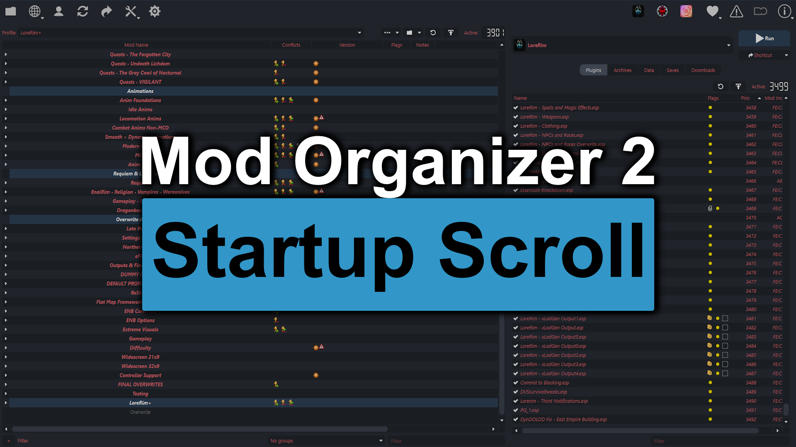

# Startup Scroll - MO2 Lists Start at Bottom

Startup Scroll is a small Mod Organizer 2 Python plugin that scrolls MO2 panes to your preferred startup positions after MO2 opens.

By default, the mod list, plugin list, and downloads list scroll to the bottom. The Archives and Data tabs can also be enabled if you want them positioned on startup. This is useful for large modlists where the active work area, final patches, overwrite output, generated plugin block, or newest downloads live near the end of the list.

## Installation

1. Copy `MO2StartupScroll.py` into your Mod Organizer 2 `plugins` folder.
2. Restart Mod Organizer 2.
3. Open `Settings -> Plugins -> Startup Scroll` to adjust behavior.

Example MO2 plugin folder:

```text
Mod Organizer\plugins\MO2StartupScroll.py
```

## Settings

- `mod_list_position`: `bottom`, `top`, or `disabled`; default `bottom`.
- `plugin_list_position`: `bottom`, `top`, or `disabled`; default `bottom`.
- `download_list_position`: `bottom`, `top`, or `disabled`; default `bottom`.
- `archive_list_position`: `bottom`, `top`, or `disabled`; default `disabled`.
- `data_tree_position`: `bottom`, `top`, or `disabled`; default `disabled`.
- `startup_delay_ms`: delay before the first scroll attempt; default `500`.
- `retry_count`: number of scroll attempts; default `4`.
- `retry_interval_ms`: delay between attempts; default `500`.
- `popup_wait_timeout_ms`: maximum time to wait for startup popups before scrolling anyway; default `120000`.
- `debug_logging`: prints debug messages to the MO2 log; default `false`.

## Notes

- The plugin is profile-agnostic and works with whichever MO2 profile is active.
- It does not change load order, mod priority, plugin state, or profile files.
- A brief visible scroll after startup is expected because MO2 populates and refreshes panes after the UI appears.
- If another plugin scrolls a pane after Startup Scroll, try increasing `retry_count`.
- Startup popups, such as NXM link prompts, can delay scroll attempts until the popup is closed.
